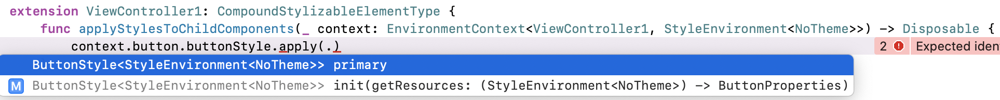
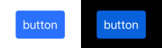

# Getting Started

## 0. Preparing the project
The repository contains the project `Starter` for which tutorial was written. The project has 3 dependencies:
- local `BlowMindStyle` swift package
- remote `SnapKit` swift package for convinient UI layout
- `R.swift` pod for generating strong typed access to string resources

and
- `RxSwift` + `RxCocoa`

on which `BlowMindStyle` depends.

`SnapKit`, `RxSwift` and `RxCocoa` will be automatically downloaded by XCode. For installing `R.swift` open `Starter` folder in the terminal and type:
```
> pod install
```

(you need installed [CocoaPods](https://cocoapods.org))

## 1. Create your own style
Open `Starter/Starter.xcworkspace` and run the project. You will see the lonely button on the center of the screen. We will write a style for it.

At first we need to write style definition. We will write a few types which describes 1) resources that are needed for stylization, 2) how to apply these resources to view, and 3) how API will look like.

- Create `StyleDefinitions` group in `Starter` project and add new file **ButtonStyle.swift** to it.

All styles have similar structure, so copy text from [template](../Templates/ViewStyle.swift) and paste to created file.

> Tip: you can save template into code snippet. Select all text and choose "Editor/Create Code Snippet" in menu. To insert snippet – press ⇧+⌘+L and drag-and-drop snippet to file.

- Press ⌥+⌘+F to show "Find and Replace" panel. Replace *<#Component#>* on *Button* and *<#View#>* on *UIButton*. Make first letter lowercased in `var ButtonStyle` property.

Let's see what types we have added:

`ButtonProperties` - struct with resources for button stylization.
- Replace `view properties` placeholder on:
```
public var backgroundColor: UIColor?
public var cornerRadius: CGFloat?
public var titleColor: UIColor?
```

`ButtonStyle` – purpose of this struct is providing resources for current environment. The environment is a type that contained values on which style can depend, like traitCollection, theme, locale, etc. Optionally a style can contain `needUpdate` method. That method receives struct with the current and previous environment and should return `true` if style resources must be applied to the view. Code from template:
```
EnvironmentChange.ThemeOrUserInterfaceStyle.needUpdate(arg)
```
It means that the button will be updated when the theme or user interface style was changed. Other changes, like horizontal/verticalSizeClass, preferredContentSizeCategory and locale will be skipped.

`StylizableElements.Button` – stores UIButton and can apply resources to it. `StylizableElements` – it is a struct intended for use as a namespace for stylizable elements.

- Add code to `apply(style:resources:)` method:
```
guard let button = view else { return }

button.backgroundColor = resources.backgroundColor
button.layer.cornerRadius = resources.cornerRadius ?? 0
button.setTitleColor(resources.titleColor, for: .normal)
```

At the end of the file you can find extension for `EnvironmentContext`. We will return to this struct later. By now we need to know that for applying `ButtonStyle` we need to use `buttonStyle` property.


<details>
  <summary>At this moment ButtonStyle.swift file should be like code inside</summary>

```
import UIKit
import BlowMindStyle

public struct ButtonProperties {
    public var backgroundColor: UIColor?
    public var cornerRadius: CGFloat?
    public var titleColor: UIColor?
}

public struct ButtonStyle<Environment: StyleEnvironmentType>: EnvironmentStyleType {
    public typealias Resources = ButtonProperties
    private let _getResources: (Environment) -> Resources

    public init(getResources: @escaping (Environment) -> Resources) {
        self._getResources = getResources
    }

    public func getResources(from environment: Environment) -> Resources {
        _getResources(environment)
    }

    public func needUpdate(_ arg: NeedUpdateStyleArgs<Environment>) -> Bool {
        EnvironmentChange.ThemeOrUserInterfaceStyle.needUpdate(arg)
    }
}

public extension StylizableElements {
    struct Button<Environment: StyleEnvironmentType> {
        weak var view: UIButton?
    }
}

extension StylizableElements.Button: StylizableElement {
    public func apply(style: ButtonStyle<Environment>, resources: ButtonProperties) {
        guard let button = view else { return }

        button.backgroundColor = resources.backgroundColor
        button.layer.cornerRadius = resources.cornerRadius ?? 0
        button.setTitleColor(resources.titleColor, for: .normal)
    }
}

public extension EnvironmentContext where Element: UIButton, Environment: StyleEnvironmentType {
    var buttonStyle: EnvironmentContext<StylizableElements.Button<Environment>, Environment> {
        replacingElement(.init(view: element))
    }
}
```

</details>

We described style definition so we can add first style for button.

- Add `Styles` group and **ButtonStyles.swift** file to it.
- Insert code to added file:
```
import UIKit

extension ButtonStyle {
    static var primary: Self {
        .init { env in
            var properties = ButtonProperties()
            properties.backgroundColor = UIColor(named: "PrimaryButtonBackground")
            properties.cornerRadius = 4
            properties.titleColor = .white
            return properties
        }
    }
}
```

Here we added `primary` style as a static property.  Inside a closure we create and set up resources that would be applied to the view.
"PrimaryButtonBackground" – named color added to Asset catalog.

- Open **ViewController1.swift** file.

`ViewController` is responsible for applying styles to child views.

- Add extension to confirm `CompoundStylizableElementType`:
```
extension ViewController1: CompoundStylizableElementType {

}
```

- accept XCode offer to add protocol stubs.

Method with name `applyStylesToChildComponents` and scary argument `context: EnvironmentContext<ViewController1, StyleEnvironment<NoTheme>>` will be added.

Because protocol `CompoundStylizableElementType` has Self-requirement, we have to make the class `ViewController` final.

- Add `final` keyword before `class ViewController1`

- Type `context.` in `applyStylesToChildComponents` and observe properties that XCode shows in autocomplete list. You can find a `button` property, but with type `EnvironmentContext<UIButton, StyleEnvironment<NoTheme>>`, not a simple `UIButton`. Accept this suggestion

- Type `.buttonStyle.apply` and choose `apply(style: ButtonStyle<StyleEnvironment<NoTheme>>)` suggestion.

- Select `primary` style


`EnvironmentContext` stores 2 property – `element` and `environment`.
You can type `.button` because `EnvironmentContext` marked with [@dynamicMemberLookup](https://github.com/apple/swift-evolution/blob/master/proposals/0252-keypath-dynamic-member-lookup.md) attribute which allows a type key paths for different type, in our case `element` type.
To stylize an element we need a 3 components – the element itself (we choose it through the `context`), the environment (transferred by `context`, thanks to it we don't need specify it manually) and the style (we specify it as `apply` method argument).

Probably you want already see styles in action. The last action required to see our button:

- Open **AppDelegate.swift** and add line
```
vc.applyStyles()
```

after the line
```
let vc = ViewController1()
```

- Run the project

You will see the button with blue background. The title is very close to the edges. We will fix it soon. Press button, notice that background don't changed. It would be nice if the background reflected highlighted state.
Change "Interface Style" to "Dark" in "Environment Overrides" panel. Notice that the background has become darker.

You can notice warning "Result of call to 'applyStyles()' is unused". Let's fix it.
Applying a style produces a `Disposable`. BlowMindStyle will react on Environment changes and update views until style `Disposable` is disposed.
To fix a problem we should store `Disposable` returned by `applyStylesToChildComponents` and dispose it when `ViewController1` is destroyed.

- In the file **ViewController1.swift** add `StyleDisposeBagOwnerType` conformance to `ViewController1`. Add property:
```
var styleDisposeBag = DisposeBag()
```

- Build the project. Warning will disappear.

By now `Disposable` from `applyStylesToChildComponents` will be added to `styleDisposeBag` which will be destoyed after `ViewController1` deinitialization.

> Note: it is not magic (almost) that warning did disappear. After adding the conformance of `StyleDisposeBagOwnerType` compiler chooses different `applyStyles` method, which don't have a return value.

- Add a new properties to `ButtonProperties`:
```
public var font: UIFont?
public var contentEdgeInsets: UIEdgeInsets?
```

- Replace `StylizableElements.Button.apply` method body on:
```
guard let button = view else { return }

button.layer.cornerRadius = resources.cornerRadius ?? 0
button.setTitleColor(resources.titleColor, for: .normal)

let cornerRadius = resources.cornerRadius ?? 0

if let normalColor = resources.backgroundColor {
    let normalBackground = UIImage.resizableImage(withSolidColor: normalColor, cornerRadius: cornerRadius)

    button.setBackgroundImage(normalBackground, for: .normal)
}

if let font = resources.font {
    button.titleLabel?.font = font
}

if let contentEdgeInsets = resources.contentEdgeInsets {
    button.contentEdgeInsets = contentEdgeInsets
}
```

Instead of using backgroudColor property we generate background image. Also we added ability to change title font.

- set values for added properties in the `primary` style:
```
properties.font = UIFont.preferredFont(forTextStyle: .body, compatibleWith: env.traitCollection)
properties.contentEdgeInsets = UIEdgeInsets(top: 10, left: 10, bottom: 10, right: 10)
```

- run the project

Button looks good. Press it – it becomes very light. To fix it replace
```
var button = UIButton(type: .system)
```
in **ViewController1.swift** on
```
var button = UIButton()
```

- Switch **Interface Style** to dark. Button background becomes darker. It is correct, but since `backgroundColor` is used for generating an image we should *resolve* color for current view controller UITraitCollection. If we override traitCollection generated image color can be wrong. Replace line in **ButtonStyles.swift** file:
```
properties.backgroundColor = UIColor(named: "PrimaryButtonBackground")
```
on
```
properties.backgroundColor = UIColor(named: "PrimaryButtonBackground")?.resolved(with: env.traitCollection)
```

Our beautiful button 😍:



Let's look again on our code for applying button style:
```
context.button.buttonStyle.apply(.primary)
```

The word button appears 2 times. It would be nice if we could write:
```
context.button.apply(style: .primary)
```

- Open **ButtonStyle.swift**. Add `import RxSwift`. Into `public extension EnvironmentContext` add method:
```
func apply(style: ButtonStyle<Environment>) -> Disposable {
    buttonStyle.apply(style)
}
```

And now we can use `context.button.apply(style: .primary)` syntax.
- Replace code in **ViewController1.swift** on code above.

Before we go furter try to write stylization for background. Name it `BackgroundStyle` and create `default` style.

Completed files:
<details>
  <summary>BackgroundStyle.swift</summary>

```
import UIKit
import BlowMindStyle

public struct BackgroundProperties {
    public var color: UIColor?
}

public struct BackgroundStyle<Environment: StyleEnvironmentType>: EnvironmentStyleType {
    public typealias Resources = BackgroundProperties
    private let _getResources: (Environment) -> Resources

    public init(getResources: @escaping (Environment) -> Resources) {
        self._getResources = getResources
    }

    public func getResources(from environment: Environment) -> Resources {
        _getResources(environment)
    }

    public func needUpdate(_ arg: NeedUpdateStyleArgs<Environment>) -> Bool {
        EnvironmentChange.ThemeOrUserInterfaceStyle.needUpdate(arg)
    }
}

public extension StylizableElements {
    struct Background<Environment: StyleEnvironmentType> {
        weak var view: UIView?
    }
}

extension StylizableElements.Background: StylizableElement {
    public func apply(style: BackgroundStyle<Environment>, resources: BackgroundProperties) {
        guard let view = view else { return }

        view.backgroundColor = resources.color
    }
}

public extension EnvironmentContext where Element: UIView, Environment: StyleEnvironmentType {
    var backgroundStyle: EnvironmentContext<StylizableElements.Background<Environment>, Environment> {
        replacingElement(.init(view: element))
    }
}
```

</details>

<details>
  <summary>BackgroundStyles.swift</summary>

```
import UIKit

extension BackgroundStyle {
    static var `default`: Self {
        .init { env in
            var properties = BackgroundProperties()
            if #available(iOS 13, *) {
                properties.color = .systemBackground
            } else {
                properties.color = .white
            }

            return properties
        }
    }
}
```

</details>

- Add next line in `ViewController1.applyStylesToChildComponents` method after applying button style:
```
context.view.backgroundStyle.apply(.default)
```

XCode will show an error:
```
Missing return in a function expected to return 'Disposable'; did you mean to return the last expression?
```

Both button and background stylizations return `Disposable`. We need to unite them into single `Disposable` and return it. For convenience in `Utils` folder added `Subscription` [function builder](https://github.com/apple/swift-evolution/blob/9992cf3c11c2d5e0ea20bee98657d93902d5b174/proposals/XXXX-function-builders.md).

- Add `@Subscription` before `func` keyword. `applyStylesToChildComponents` should be looks like:
```
@Subscription func applyStylesToChildComponents(_ context: EnvironmentContext<ViewController1, StyleEnvironment<NoTheme>>) -> Disposable {
    context.button.apply(style: .primary)
    context.view.backgroundStyle.apply(.default)
}
```

- Remove the next lines from `viewDidLoad` method. They are not needed.
```
if #available(iOS 13, *) {
    view.backgroundColor = .systemBackground
} else {
    view.backgroundColor = .white
}
```

One more improvement. We will add the ability to skip specifying `.default` for `BackgroundStyle`.

- Open **BackgroundStyles.swift**. Add `import BlowMindStyle`. Add conformance to `DefaultStyleType`. XCode will say that property must be public, fix it:
```
import BlowMindStyle

extension BackgroundStyle: DefaultStyleType {
    public static var `default`: Self {
        ...
    }
}
```

> Note: in the [template](../Templates/ViewStyle.swift) styles marked as `public` for cases when a separate framework is used for styles. You can safety remove `public` modifier.

- In **ViewController1.swift** replace
```
context.view.backgroundStyle.apply(.default)
```
on
```
context.view.backgroundStyle.apply()
```

By now you learned a lot of – how to create style definition, styles, how to apply them to views, how to specify when a view should be updated, learned about role of `CompoundStylizableElementType` and `StyleDisposeBagOwnerType`, how to use `@Subscription` to combine `Disposable`-s and what is `EnvironmentContext` and how it works.

Completed code for current section you can find in **Starter_Completed/1/** folder.

In the next section you will know how to add theme and update views after chaning the theme.

## 2. Create a theme

## 3. Switch styles according to view state

## 4. Text stylization

## 5. Handling preferred content size category update

## 6. Stylization for reusable views (like UITableViewCell)

## 7. Localize the UI
