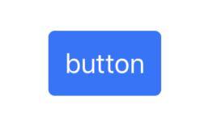
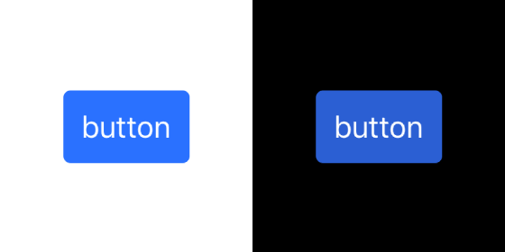

# 1. Create your own style

In this section, you will learn how to create and apply styles for views.

Open `Tutorial/Starters/Starter/Starter.xcodeproj` and run the project. You will see the lonely button on the center of the screen. We will add styling for the button. The final result you can see in the screenshot below:



Before we add the code, let's take a look at the description of what will be understood by the style.

> Style is an entity that provides *a set of properties* that we assign to a view. Values of properties can depend on application/view states (I will call the union of these states an *environment*): appearance (light/dark), current locale, UITraitCollection and other.

For button style, we will use next properties: background, corner radius, title color, font and paddings.

- Create `StyleDefinitions` group in `Starter` project and add new file **ButtonStyle.swift** to it.
- Add imports:
```swift
import UIKit
import BlowMindStyle
```
- Create a type for storing style properties:
```swift
struct ButtonProperties {
    var backgroundColor: UIColor?
    var cornerRadius: CGFloat?
    var titleColor: UIColor?
    var font: UIFont?
    var contentEdgeInsets: UIEdgeInsets?
}
```

- Create style type. Insert following code after `ButtonProperties`:
```swift
final class ButtonStyle<Environment: StyleEnvironmentType>: EnvironmentStyle<ButtonProperties, Environment> { }
```
> Note: `EnvironmentStyle` class is not intended for overriding methods, it is intended for specifying resources type (`ButtonProperties`).

The purpose of this class is to provide resources for the current environment. The environment is a type that contained values on which style can depend, like traitCollection, theme, locale, etc. `EnvironmentStyle` is implementation of `EnvironmentStyleType`:
```swift
public protocol EnvironmentStyleType: StyleType {
    associatedtype Environment: StyleEnvironmentType
    func getResources(from environment: Environment) -> Resources
}
```
> Style type must conform to `EnvironmentStyleType`. `EnvironmentStyle` inheritance is not required, but it is the easiest way to create style type.

`ButtonStyle` initializer has argument of type `(Environment) -> ButtonProperties`. We will add a button style soon, but before we need to add code for applying `ButtonProperties` to `UIButton`.

- Insert following code after `ButtonStyle`:
```swift
extension EnvironmentContext where Element: UIButton {
    var buttonStyle: StylableElement<ButtonStyle<StyleEnvironment>> {
        stylableElement { button, style, resources in
            button.setTitleColor(resources.titleColor, for: .normal)

            let cornerRadius = resources.cornerRadius ?? 0

            if let normalColor = resources.backgroundColor {
                let normalBackground = UIImage.resizableImage(withSolidColor: normalColor, cornerRadius: cornerRadius)

                button.setBackgroundImage(normalBackground, for: .normal)
            } else {
                button.setBackgroundImage(nil, for: .normal)
            }

            button.contentEdgeInsets = resources.contentEdgeInsets ?? .zero
        }
    }
}
```

In this code, we added api for applying `ButtonStyle`.
`EnvironmentContext` is a struct, that stores `element` (button for example) and the `environment`. We use the constraint `where Element: UIButton`, so `buttonStyle` property is available only for subclasses of `UIButton`.

`stylableElement(_:)` is function that returns `StylableElement<Style>`. That object provides methods for applying styles.
`stylableElement(_:)` receives function which arguments are element (`UIButton` is our case), style and resources (`ButtonProperties`). In this function we assign properties to the button.

We described style definition so we can add first style for button.

- Add `Styles` group and **ButtonStyles.swift** file to it.
- Insert code to added file:
```swift
import UIKit

extension ButtonStyle {
    static var primary: ButtonStyle {
        .init { env in
            var properties = ButtonProperties()
            properties.backgroundColor = UIColor(named: "PrimaryButtonBackground")
            properties.cornerRadius = 4
            properties.titleColor = .white
            properties.font = UIFont.preferredFont(forTextStyle: .body, compatibleWith: env.traitCollection)
            properties.contentEdgeInsets = UIEdgeInsets(top: 10, left: 10, bottom: 10, right: 10)
            return properties
        }
    }
}
```

We added the `primary` style. `ButtonStyle` initializer takes a function that receives `Environment` and returns `ButtonProperties`. Via `env` we can get current traitCollection, locale, and theme. "PrimaryButtonBackground" – already added color to `Assets.xcassets`

We ready to apply added style.
- Open **ViewController1.swift**
- Add `import BlowMindStyle`
- Add code to the end of `viewDidLoad()`:
```swift
button.setUpStyles {
    $0.buttonStyle.apply(.primary)
}
```
- Replace button type from `.system` to `.custom`

Run project, you will see styled button. It looks great!



`setUpStyles(_:)` is simplest method for applying styles. It takes a function that receives generic `EnvironmentContext` argument. For code above the type will be `EnvironmentContext<UIButton, DefaultStyleEnvironmentConvertible>`. As name `DefaultStyleEnvironmentConvertible` says that struct is default implementation of `StyleEnvironmentConvertible`. `StyleEnvironmentConvertible` is:
```swift
public protocol StyleEnvironmentConvertible: LocaleEnvironmentType, ThemeEnvironmentType {
    associatedtype StyleEnvironment: StyleEnvironmentType

    func toStyleEnvironment(_ traitCollection: UITraitCollection) -> StyleEnvironment
}
```

Both `StyleEnvironmentConvertible` and `StyleEnvironmentType` provide environment info. Some data like locale and theme propagated from `UIViewController` / `UIView` hierarchy by `BlowMindStyle` or manually. But the `traitCollection` propagated by `UIKit`. `StyleEnvironmentConvertible` is environment that not include `traitCollection` and can create `StyleEnvironment` that carries all environment data, indluding `traitCollection`.

Let's add a new style for setting up a view background.
- Add file **BackgroundStyle.swift** to `StyleDefinitions` and insert following code:
```swift
import UIKit
import BlowMindStyle

struct BackgroundProperties {
    var color: UIColor?
}

final class BackgroundStyle<Environment: StyleEnvironmentType>: EnvironmentStyle<BackgroundProperties, Environment> { }

extension EnvironmentContext where Element: UIView {
    var backgroundStyle: StylableElement<BackgroundStyle<StyleEnvironment>> {
        stylableElement { view, style, resources in
            view.backgroundColor = resources.color
        }
    }
}

```
- Add file **BackgroundStyles.swift** to `Styles` and insert following code:
```swift
import UIKit
import BlowMindStyle

extension BackgroundStyle {
    static var `default`: BackgroundStyle {
        .init { _ in
            if #available(iOS 13, *) {
                return BackgroundProperties(color: .systemBackground)
            } else {
                return BackgroundProperties(color: .white)
            }
        }
    }
}
```

Added code have the same structure as for button style:
- created struct for resources (`BackgroundProperties`)
- added style definition (`BackgroundStyle`)
- added api for applying style `EnvironmentContext.backgroundStyle`
- and finally added default style for `BackgroundStyle`.

Open **ViewController1.swift** and replace
```swift
if #available(iOS 13, *) {
    view.backgroundColor = .systemBackground
} else {
    view.backgroundColor = .white
}
```
on
```swift
view.setUpStyles {
    $0.backgroundStyle.apply(.default)
}
```

Added code removes resources (colors) from `UIViewController`. If will be needed to update colors, only one place will be updated – style.

By now we have 2 setups.
```swift
view.setUpStyles {
    $0.backgroundStyle.apply(.default)
}
...
button.setUpStyles {
    $0.buttonStyle.apply(.primary)
}
```

Imagine if we have many views in the view controller. The code for setting up styles will take many lines of code. We can reduce it by combining setups into one block.
- remove
```swift
view.setUpStyles { ... }
```
and
```swift
button.setUpStyles { ... }
```
- add code to the end of `viewDidLoad()`:
```swift
setUpStyles {
    $0.view.backgroundStyle.apply(.default)
    $0.button.buttonStyle.apply(.primary)
}
```
Here we call `setUpStyles(_:)` on `ViewController1`. `$0` is `EnvironmentContext<ViewController1, DefaultStyleEnvironmentConvertible>`. If you open `EnvironmentContext` code you don't find `view` or `button` properties, but you may notice [@dynamicMemberLookup](https://github.com/apple/swift-evolution/blob/master/proposals/0252-keypath-dynamic-member-lookup.md) attribute. It allows use properties from `element` to create new `EnvironmentContext` that have `element` taken by key path. `EnvironmentContext<ViewController1, DefaultStyleEnvironmentConvertible>` with path `\.view` give us `EnvironmentContext<UIView, DefaultStyleEnvironmentConvertible>`, which we can use to apply `backgroundStyle`.

We are almost done. The stylization code is compact and powerful, but it has 2 small aesthetics problems:
1. Usage of `.default`. It is desirable to skip default style argument.
2. `$0.button.buttonStyle.apply(.primary)` have two "button" words. For a button, it would be evident that we apply button style.

To fix first problem, open **BackgroundStyles.swift** and add conformance `DefaultStyleType` to `BackgroundStyle`. Replace
```swift
extension BackgroundStyle
```
on
```swift
extension BackgroundStyle: DefaultStyleType {
```

`DefaultStyleType` says that style have default implementation and can be skipped in `apply(_:)` method.

To fix second problem open **ButtonStyle.swift** and add the following code at the end of the extension.
```swift
func apply(style: ButtonStyle<StyleEnvironment>) {
    buttonStyle.apply(style)
}
```

In **ViewController1.swift** replace `setUpStyles { ... }` on
```swift
setUpStyles {
    $0.view.backgroundStyle.apply()
    $0.button.apply(style: .primary)
}
```

The code became a little prettier.

In this section, you learned how to add and apply styles. In the [next section](Part2_createATheme.md), you will learn how to create a theme for application and how to propagate the environment through view controller hierarchy.

Completed code for current section you can find in **Tutorial/Completed/1/** folder.