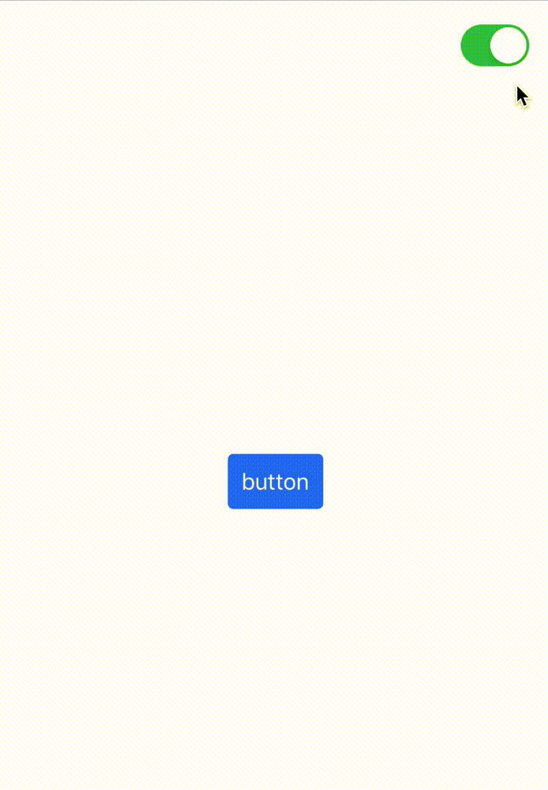

# 3. Switch styles according to the state

Sometimes we need to change styles for view dynamically depending on some state. In this section, we will switch button style depending on `UISwitch` value.

> Note: We will use code from previous section. You can find completed solution in **Tutorial/Completed/2** folder.

To demonstrate switching of styles we need to have at least 2 styles, but now we have only '.primary' theme. Let's add another one, `.simple` style.

- Open `ButtonStyles.swift` and add code to `ButtonStyle` extension:
```swift
extension ButtonStyle {
    static var simple: ButtonStyle {
        .init { env in
            var properties = ButtonProperties()
            let color = UIColor(named: "PrimaryButtonBackground")
            properties.titleColor = color
            properties.highlightedTitleColor = color?.withAlphaComponent(0.5)
            return properties
        }
    }
}
```

The new style doesn't use background color. To make the pressed state distinctive from normal state, we will add new property `highlightedTitleColor`.
- open `ButtonStyle.swift`.
- add following property to `ButtonProperties` (after `titleColor`):
```swift
var highlightedTitleColor: UIColor?
```
- in `EnvironmentContext.buttonStyle` after
    ```swift
    button.setTitleColor(resources.titleColor, for: .normal)
    ```
    add following code
    ```swift
    button.setTitleColor(resources.highlightedTitleColor, for: .highlighted)
    ```

We will use `UISwitch` to toggle style, so remove the following code from `ViewController1` that was used for changing the application theme:
```swift
switchControl.rx.isOn.changed.subscribe(onNext: { isOn in
    AppEnvironmentProvider.shared.setCurrentTheme(isOn ? .theme2 : .theme1)
}).disposed(by: disposeBag)
```

Let's assume that if UISwitch is on, so we should use `.primary` button style. Otherwise – `.simple` style.

There are 2 approaches to implement such behavior, but before we try they, remove existing code for applying button style:
```swift
context.button.apply(style: .primary)
```

### Approach 1: re-setup styles

- add following code to the end of `viewDidLoad()`:
```swift
switchControl.rx.isOn.subscribe(onNext: { [unowned self] isOn in
    self.button.setUpStyles(with: self.environmentRelay) {
        $0.buttonStyle.apply(isOn ? .primary : .simple)
    }
}).disposed(by: disposeBag)
```

Passed `onNext` function executes during subscription and when control value changes. In this function, we call `button.setUpStyles(with:setup:)` (we used this method already in the previous section) where the style selected depending on the `isOn` state is applied.



### Approach 2: using apply(forState:_:)

- remove the code added in "Approach 1"
- add following code to the end of `applyStylesToChildComponents(_:)` method:
```swift
context.button.buttonStyle.apply(forState: switchControl.rx.isOn) { isOn in isOn ? .primary : .simple }
```

We use a new method `apply(forState:_:)`. It allows specifying observable state (`switchControl.rx.isOn`) and the function that selects the desired style.

Approach 2 is shorter and does not require `disposeBag` and `self.environmentRelay`. It is a preferred way to switch style. But in some cases it is not applicable, for example when part of the view hierarchy replaced – we should set up styles for newly created views.

You learned how to switch component styles depending on the state.
Some styles can use not all resources – our `.simple` style doesn't use background, and `.primary` don't use `highlightedTitleColor`. Make sure that the code, where you apply resources (`EnvironmentContext.buttonStyle`) assign default values to the view properties when resources are not set to avoid a situation when after applying a new style some properties (background, for example) stays from the previous style.

By now you can stylize almost any type of view using described methods in previous and this sections. The exception is text. It requires some new instruments.

[Next section: Text stylization](Part4_textStylization.md)

Completed code for current section you can find in **Tutorial/Completed/3/** folder.