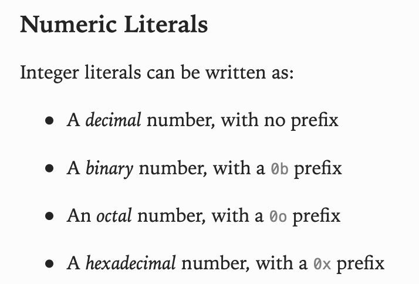

# 4. Text Stylization

The `ButtonStyle` added in the previous sections describes appearance for a whole component (a button). Such an approach can be used to write style for `UILabel` too, but sometimes some text parts should have special stylization. For example, words with bold font, underlined phrase, highlighted text, etc.

- Open "Starter.xcworkspace" from "Tutorials/Starter/Starter_4". This project contains the code from previous section and new controller `ViewControllerWithText`.

Run the project. You will see a poorly formatted text.


The text is taken from "The Swift Programming Language" book where text looks much prettier.



We want to format the text so that it looks like the text from a book. Currently, we use plain text, that doesn't have additional information that would help us to understand where is the title, where is italic text and where is gray-colored text.

- open **ViewControllerWithText.swift** and add
```swift
import SemanticString
```

[SemanticString](https://github.com/BlowMindStyle/SemanticString) is the library that provides string abstraction of a string with the ability to store structural semantics for text.

> Note: `BlowMindStyle` depends on `SemanticString`. It is not necessary to add this library to your **Podfile** or **Package.swift**.

- remove the code
```swift
label.text = text
label.numberOfLines = 0
```

- replace existing code
```swift
private var text: String {
    """
    Numeric Literals
    Integer literals can be written as:
    •\tA decimal number, with no prefix
    •\tA binary number, with a 0b prefix
    •\tAn octal number, with a 0o prefix
    •\tA hexadecimal number, with a 0x prefix
    """
}
```
on
```swift
private var text: SemanticString {
    SemanticString(xml: """
    <title>Numeric Literals</title>
    Integer literals can be written as:
    <li>•\tA <em>decimal</em> number, with no prefix</li>
    <li>•\tA <em>binary</em> number, with a <code>0b</code> prefix</li>
    <li>•\tAn <em>octal</em> number, with a <code>0o</code> prefix</li>
    <li>•\tA <em>hexadecimal</em> number, with a <code>0x</code> prefix</li>
    """)
}
```

We created `SemanticString` using xml-like syntax. We marked the text with tags `title`, `li`, `em` and `code`. We will use it later in styles. To avoid duplication of these tags as literals, let's create constants for them.

- add a new file with name `SemanticString.TextStyle+Extensions.swift` and add following code:
```swift
import SemanticString

extension SemanticString.TextStyle {
    static let emphasis: SemanticString.TextStyle = "em"
    static let code: SemanticString.TextStyle = "code"
    static let listItem: SemanticString.TextStyle = "li"
}
```

> Note: `SemanticString` already have `title`.

- add file **TextStyle.swift** in **StyleDefinitions** group.

> Note: we will use `TextStyle` for the type that provides resources (similar to `ButtonStyle`). Do not confuse with `SemanticString.TextStyle` type that used for tags like `title`, `li`, etc.

- add following code
```swift
import UIKit
import BlowMindStyle
import SemanticString

struct TextProperties: TextAttributesProviderType {
    var textAttributes: TextAttributes
    var numberOfLines = 0
}

final class TextStyle<Environment: StyleEnvironmentType>: SemanticStringStyle<TextProperties, Environment> { }
```

As previously for `ButtonStyle` we described the resources (`TextProperties`) and style type `TextStyle`. Pay attention that `TextStyle` inherited not from `EnvironmentStyle`, but from `SemanticStringStyle`, `SemanticStringStyle` contains special logic for text formatting. It requires that resources have `var textAttributes: TextAttributes` property (protocol `TextAttributesProviderType`). `TextAttributes` is a wrapper for `[NSAttributedString.Key : Any]`.

- add following code:
```swift
extension EnvironmentContext where Element: UILabel {
    var textStyle: TextStylableElement<TextStyle<StyleEnvironment>> {
        textStylableElement { label, style, resources, string in
            if let string = string {
                label.attributedText = string
            }

            label.numberOfLines = resources.numberOfLines
        }
    }
}
```

In this code we apply `resources` (`TextProperties`) and formatted `string` (`Optional<NSAttributedString>`)

> Note: if `string` is nil it means that text was not set, so we keep current `attributedText`.

- add **TextStyles.swift** file to **Styles** group.
- add following code to new file:
```swift
import UIKit
import BlowMindStyle
import SemanticString

extension TextStyle {
    static var article: TextStyle {
        .init(
            getResources: { env in getTextProperties(for: env.traitCollection) },
            setAttributes: { textStyle, attributes, style, env in
                setTextAttributes(forStyle: textStyle, attributes: &attributes, traitCollection: env.traitCollection)
        })
    }
}
```

The code refers to 2 undefined functions. We will add them soon.
`TextStyle` have multiple initializers, we use the most advanced one. `getResources` argument requires a function that returns `TextProperties`. `TextProperties.textAttributes` will be used for whole text.
`setAttributes` argument requires a function that doesn't return a value, but should update received `attributes` for known `textStyle` (`SemanticString.TextStyle`).
For example, we have `<red>red</red> text`. If all text should be black, except marked with `red`, then `getResources` should return attributes with black foreground color, and function `setAttributes` should set `attributes.foregroundColor = .red`.

- add following code after extension
```swift
private func getTextProperties(for traitCollection: UITraitCollection) -> TextProperties {
    var attributes = TextAttributes()
    attributes.font = UIFont.preferredFont(forTextStyle: .body, compatibleWith: traitCollection)

    let paragraphStyle = NSMutableParagraphStyle()
    paragraphStyle.paragraphSpacing = UIFontMetrics.default.scaledValue(for: 5, compatibleWith: traitCollection)
    paragraphStyle.lineBreakMode = .byWordWrapping
    attributes.paragraphStyle = paragraphStyle

    return TextProperties(textAttributes: attributes, numberOfLines: 0)
}
```

Here we form `TextProperties`, that contains text properties that would be applied to all text (`textAttributes`), and other properties (`numberOfLines`). We set up `font` and `paragraphStyle` attributes. Note that for `paragraphStyle.paragraphSpacing` we use `UIFontMetrics.default.scaledValue`, it adapt the size for current content size category.

- add following code below
```swift
private func setTextAttributes(
    forStyle style: SemanticString.TextStyle,
    attributes: inout TextAttributes,
    traitCollection: UITraitCollection) {
    switch style {
    case .title:
        attributes.font = UIFont.preferredFont(forTextStyle: .title1, compatibleWith: traitCollection)
        let paragraphStyle = (attributes.paragraphStyle?.mutableCopy() as? NSMutableParagraphStyle) ?? .init()
        paragraphStyle.paragraphSpacing = UIFontMetrics.default.scaledValue(for: 14, compatibleWith: traitCollection)
        attributes.paragraphStyle = paragraphStyle

    case .emphasis:
        guard let font = attributes.font else { return }
        var symbolicTraits = font.fontDescriptor.symbolicTraits
        symbolicTraits.insert(.traitItalic)

        guard let descriptor = font.fontDescriptor.withSymbolicTraits(symbolicTraits) else { return }
        attributes.font = UIFont(descriptor: descriptor, size: font.pointSize)

    case .code:
        if #available(iOS 13.0, *) {
            attributes.foregroundColor = UIColor.secondaryLabel
        } else {
            attributes.foregroundColor = UIColor.gray
        }

        guard let font = attributes.font else { return }
        if #available(iOS 12.0, *) {
            attributes.font = UIFont.monospacedSystemFont(ofSize: font.pointSize, weight: .regular)
        }

    case .listItem:
        let paragraphStyle = (attributes.paragraphStyle?.mutableCopy() as? NSMutableParagraphStyle) ?? .init()
        let listItemTextOffset = UIFontMetrics.default.scaledValue(for: 22, compatibleWith: traitCollection)
        paragraphStyle.tabStops = [NSTextTab(textAlignment: .natural, location: listItemTextOffset)]
        paragraphStyle.paragraphSpacingBefore = UIFontMetrics.default.scaledValue(for: 5, compatibleWith: traitCollection)
        paragraphStyle.headIndent = listItemTextOffset
        paragraphStyle.headIndent = UIFontMetrics.default.scaledValue(for: 10, compatibleWith: traitCollection)
        paragraphStyle.firstLineHeadIndent = UIFontMetrics.default.scaledValue(for: 10, compatibleWith: traitCollection)
        attributes.paragraphStyle = paragraphStyle

    default:
        break
    }
}
```

Here we set up attributes for known text styles (`title`, `emphasis`, `code` and `listItem`). Pay attention that code can use current attributes. The code for `emphasis` reads the current font and makes is italic. The code for `title` and `listItem` makes a copy of the current `paragraphStyle` and mutates it.

Provided attributes from `getTextProperties` and `setTextAttributes` allows to convert `SemanticString` to `NSAttributedString`, which is passed for element styling (last argument in `textStylableElement { label, style, resources, string in`)

- open `ViewControllerWithText.swift`
- after `context.view.backgroundStyle.apply()` add following code
```swift
context.label.textStyle.apply(.article, text: text)
```

Here we applying added text style with existing text. `apply(_:text:)` method have an overload that takes observable text. It could be useful if the text dynamically changes.

Run the project. We have pretty formatted text.


Because we used `UIFont.preferredFont(forTextStyle:compatibleWith)` and `UIFontMetrics.default.scaledValue(for:compatibleWith:)`, the text looks good even for the smallest and the biggest font:


In this section you learned how to add styles for text components.

Completed code for current section you can find in **Tutorial/Completed/4/** folder.